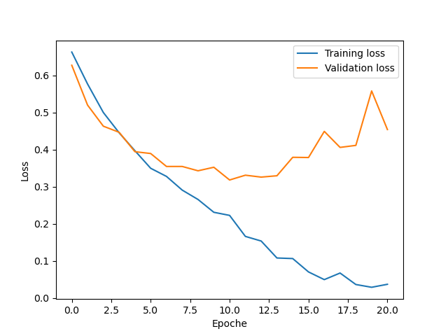

# Analyse von neuronalen Netzen am Beispiel der Bilderkennung

Das ist der offizielle Code zur Seminararbeit "Analyse von neuronalen Netzen am Beispiel der Bilderkennung" von Daniel Shamsi.

## Beschreibung

In dieser Arbeit wird Deep Learning zur Klassifikation von Katzen und Hunden angewandt.
Der Datensatz kommt von Kaggle und ist unter folgendem Link zu finden: https://www.kaggle.com/c/dogs-vs-cats/data.
Der Testdatensatz wurde mit einem auf [ImageNet vortrainierten RegNetY_32GF Modell](https://pytorch.org/vision/main/models/generated/torchvision.models.regnet_y_32gf.html#torchvision.models.RegNet_Y_32GF_Weights) erstellt, indem die maximale Wahrscheinlichkeit des Modells auf Hundeklassen mit Katzenklassen verglichen wurde.
Anschließend wurde der Test-Datensatz händisch überarbeitet.


Bildquelle: https://storage.googleapis.com/kaggle-competitions/kaggle/3362/media/woof_meow.jpg

## Installation

Zur Installation wird empfohlen, die [Anaconda Distribution](https://www.anaconda.com/distribution/) zu verwenden.

1. Repository klonen:
```bash
   git clone https://github.com/theNoobSkill/wseminar.git
```
2. Eine virtuelle Umgebung erstellen und aktivieren:
```bash
   conda create -n wseminar python=3.10
   conda activate wseminar
```
3. [PyTorch and Torchvision](https://pytorch.org/get-started/locally/) installieren.
4. In das Verzeichnis wechseln:
```bash
   cd wseminar
```
5. Abhängigkeiten installieren:
```bash
   conda env update --file environment.yml
```

## Ausführung

1. In das Verzeichnis wechseln:
```bash
   cd wseminar
```
2. Die virtuelle Umgebung aktivieren:
```bash
   conda activate wseminar
```
3. Das Skript laufen lassen:
```bash
   jupyter notebook w_seminar.ipynb
```

Das Skript trainiert und speichert das Modell, erstellt eine loss Kurve und gibt die Genauigkeit auf dem Test-Datensatz aus.

